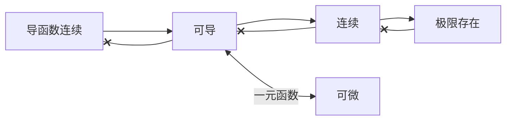

<a href="/notes408/chapters_index"> Indexes </a> > <a href="/notes408/indexes/NLl5iEeokv"> 高数笔记 </a> > <a href="/notes408/indexes/1wT7FgTIFV"> 导数和微分 </a> > 笔记

### 1. 可导性判断

#### 1.1. 导数定义整体替换

- $f'(x_0)$ 导数定义
  $$
  \lim_{\Delta x\to 0} \frac{f(x_0+\Delta x)-f(x_0)}{\Delta x}
  $$

- $\Delta x$ 可以替换为任意无穷小式，对应分母上的 $\Delta x$ 也要整体替换。

#### 1.2. 双侧性

- 场景：已知极限存在，判断是否可导。
- 根据导数要求，**极限式中的 $x_0+\Delta x$ 要覆盖 $x_0$ 左右两侧的值**。若不满足，不能保证可导。
- 例：已知 $\lim_{x\to 0} f(x^2)/x^2$ 存在，且 $f(0)=0$，**不能推得 $f'(0)$ 存在**。因为 $x^2>0$，只能保证在 $0_+$ 一侧 $f'(x)$ 存在。

#### 1.3. 极限拆分

- 场景：由已知极限式凑导数定义时，需要拆分极限。**需要满足拆出来的两个极限都存在才成立**。
- 若拆分出来的极限式恰好为导数定义。则由于事先不知道导数是否存在，就不能进行拆分。
- 例：已知 $\lim_{x\to 0}\left(f(x)-f(-x)\right)$ 存在且 $f(0)=0$，不能推得 $f'(0)$ 存在。

#### 1.4. 可导和连续的关系

### 2. 导数计算

#### 2.1. 几个反三角函数的导数

|        $f(x)$         |          $f'(x)$          |
| :-------------------: | :-----------------------: |
|      $\arcsin x$      | $\frac{1}{\sqrt{1-x^2}}$  |
|      $\arccos x$      | $-\frac{1}{\sqrt{1-x^2}}$ |
|      $\arctan x$      |     $\frac{1}{1+x^2}$     |
| $\mathrm{arccot}\; x$ |    $-\frac{1}{1+x^2}$     |

#### 2.2. 分段函数求导

常规方法（推荐）

- 非分段点处直接套公式求；
- 分端点处用导数定义求；

快速方法（有条件）

- 条件：$f(x)$ 在 $x_0$ 连续，$f'(x)$ 在 $x\to x_0$ 时极限存在。
- 结论：$f'(x)$ 在 $x\to x_0$ 两侧的**极限值与 $f'(x_0)$ 两侧导数值相等**。
- 场景：分段函数求导数值。

#### 2.3. 高阶导数

- 莱布尼茨公式
  $$
  (uv)^{(n)}=\mathrm{C}_n^0 u^{(n)}v+\mathrm{C}_n^1 u^{(n-1)}v^{(1)}+\cdots+{C}_n^n uv^{(n)}
  $$
  
- 利用 $x_0$ 处的泰勒展开，即麦克劳林展开
  $$
  f(x)=f(0)+f^{(1)}(0)x+\frac{f^{(2)}(0)}{2!}x^2+\cdots+\frac{f^{(n)}(0)}{n!}x^n+o(x^n)
  $$
  
  - 若能将 $f(x)$ 直接展开为幂级数形式，则 $x^{n}$ 的系数 $a^n=f^{(n)}(0)/n!$，于是就可以求出 $f^{(n)}(0)$。
  - 适用于**套公式展开为幂级数较为简单的函数**。
  - 例：$1/(ax+b)$，可化为 $1/(1-X)$ 的形式，然后幂级数展开。
- 